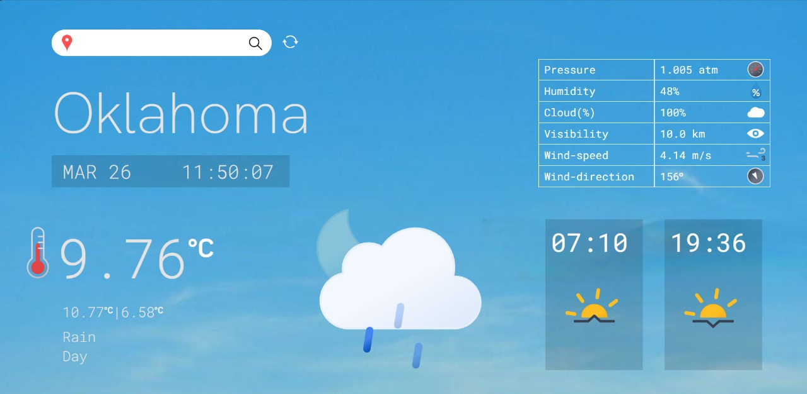

# Current Weather Report using OpenWeatherMap API

This program utilizes the OpenWeatherMap Geocoding API to convert a city name to its corresponding latitude and longitude coordinates. It provides a simple way to retrieve the geographic information of a city using the OpenWeatherMap service.

## prerequisites

Before running this program, ensure you have the following prerequisites:

- Python 3 installed
- Latest version of Django in your machine.
- `requests` library installed (can be installed via `pip install requests`)
- An API key from OpenWeatherMap. You can sign up for a free account at [OpenWeatherMap](https://openweathermap.org/) and obtain an API key.


## Usage

- First create a file called `secret.py` inside the weather-app folder. This file will return the API key for the OpenWeatherMap API. The API key is stored in the variable `API_KEY`.

- Install the required dependencies by running the following command:

    ```python
    pip install -r requirements.txt
    ```


- To use this program, run the following command line interface:

     ```python
     python manage.py runserver
     ```

- It will start a server , which on opening will look like this.




Enter the city name and it will show the current weather of that city.

It will show the following details:
- City Name
- Temperature
- Pressure
- Cloudiness
- Humidity
- Visibility
- Wind Speed
- Wind direction
- Weather Description including icon
- sunrise and sunset time

It also changes the background image according to the weather and time of the day.

## Features

- The program uses the OpenWeatherMap API to retrieve the current weather of a city.
- it will display live weather location when you click refresh icon beside search box


## Contributing Authors
- Saksham Kumar ([Polymath-Saksh](https://github.com/Polymath-Saksh))
- Aloukik Joshi ([aloukikjoshi](https://github.com/aloukikjoshi))
- Nihal Pandey ([NihalPandey5060](https://github.com/NihalPandey5060))
- Ankit Raj([ankitraj5670](https://github.com/ankitraj5670))

  
## License
This project is licensed under the MIT License - see the [LICENSE](LICENSE) file for details.

all rights reserved to the authors.

this cant be reproduced
